# Venda-Cursos

Sistema web full-stack para gerenciamento de cursos online e presenciais, desenvolvido com Flask (backend) e React (frontend).

## Sobre o Projeto

Sistema completo de CRUD (Create, Read, Update, Delete) para gerenciamento de cursos, permitindo cadastro, edição, visualização e exclusão de cursos com upload de imagens.

## Funcionalidades

- Listagem de cursos com carrossel animado na home
- Cadastro de novos cursos
- Edição de cursos existentes
- Exclusão de cursos
- Upload e gerenciamento de imagens dos cursos
- Filtros por tipo (online/presencial) e status (ativo/inativo)
- Interface responsiva e moderna

## Tecnologias Utilizadas

### Backend
- Python 3.x
- Flask 3.1.2
- Flask-CORS 6.0.2

### Frontend
- React 19.2.0
- React Router DOM 7.13.0
- Axios 1.13.4
- Tailwind CSS 4.1.18
- Vite (rolldown-vite) 7.2.5
- React Slick 0.31.0

## Estrutura do Projeto

```
projeto/
├── backend/
│   ├── app.py                 # Aplicação principal Flask
│   ├── routes/
│   │   ├── __init__.py
│   │   └── cursos_routes.py   # Rotas dos cursos
│   ├── services/
│   │   └── cursos_service.py  # Lógica de negócio
│   ├── validators/
│   │   └── cursos_validator.py # Validações
│   ├── dados/
│   │   └── cursos.json        # Armazenamento de dados
│   ├── uploads/
│   │   └── cursos/            # Imagens dos cursos
│   └── requirements.txt
│
├── frontend/
│   ├── src/
│   │   ├── components/
│   │   │   ├── Navbar.jsx
│   │   │   ├── HomeList.jsx
│   │   │   └── crud/
│   │   │       ├── FormCourses.jsx
│   │   │       └── EditCourses.jsx
│   │   ├── pages/
│   │   │   ├── Home.jsx
│   │   │   └── Courses.jsx
│   │   ├── services/
│   │   │   └── api.js
│   │   ├── App.jsx
│   │   └── main.jsx
│   ├── package.json
│   └── vite.config.js
│
└── README.md
```

## Como Rodar o Projeto

### Pré-requisitos

- Python 3.x
- Node.js (versão 20.19.0 ou superior)
- npm ou yarn

### Backend

1. **Navegue até a pasta do backend:**
   ```bash
   cd backend
   ```

2. **Crie um ambiente virtual (recomendado):**
   ```bash
   python -m venv venv
   ```

3. **Ative o ambiente virtual:**
   - Windows:
     ```bash
     venv\Scripts\activate
     ```
   - Linux/Mac:
     ```bash
     source venv/bin/activate
     ```

4. **Instale as dependências:**
   ```bash
   pip install -r requirements.txt
   ```

5. **Execute o servidor:**
   ```bash
   python app.py
   ```

   O backend estará rodando em `http://localhost:5000`

### Frontend

1. **Navegue até a pasta do frontend:**
   ```bash
   cd frontend
   ```

2. **Instale as dependências:**
   ```bash
   npm install
   ```

3. **Execute o servidor de desenvolvimento:**
   ```bash
   npm run dev
   ```

   O frontend estará rodando em `http://localhost:5173`

## Endpoints da API

### Cursos

| Método | Endpoint | Descrição |
|--------|----------|-----------|
| GET | `/cursos` | Lista todos os cursos |
| GET | `/cursos/<id>` | Busca um curso específico |
| POST | `/cursos` | Cria um novo curso |
| PUT | `/cursos/<id>` | Atualiza um curso existente |
| PATCH | `/cursos/<id>/status` | Atualiza apenas o status de um curso |
| DELETE | `/cursos/<id>` | Deleta um curso |
| POST | `/cursos/upload` | Faz upload de imagem do curso |

### Exemplo de Payload - Criar Curso

```json
{
  "titulo": "Curso de Python",
  "descricao": "Aprenda Python do zero ao avançado",
  "valor": 199.90,
  "tipo": "curso-online",
  "status": "ativo",
  "imagem_url": "python.jpg"
}
```

### Parâmetros de Query

- `?tipo=curso-online` ou `?tipo=curso-presencial` - Filtra por tipo
- `?status=ativo` ou `?status=inativo` - Filtra por status

## Rotas do Frontend

- `/` - Home com carrossel de cursos
- `/cursos` - Lista completa de cursos
- `/cursos/novo` - Formulário de cadastro
- `/cursos/editar/:id` - Formulário de edição

## Validações

### Campos Obrigatórios
- Título (mínimo 3 caracteres)
- Descrição
- Valor (não pode ser negativo)
- Tipo (curso-online ou curso-presencial)
- Status (ativo ou inativo)

## Tipos Permitidos

- `curso-online` - Cursos em formato online
- `curso-presencial` - Cursos presenciais

## Status Permitidos

- `ativo` - Curso disponível para matrícula
- `inativo` - Curso temporariamente indisponível

## Upload de Imagens

- Formatos aceitos: JPG, JPEG, PNG, GIF, JFIF
- As imagens são salvas em `/backend/uploads/cursos/`
- Nome único gerado com UUID para evitar conflitos

## Características do Design

- Design moderno e minimalista
- Paleta de cores em tons de slate e azul
- Animações suaves e transições
- Carrossel automático na página inicial
- Cards responsivos para visualização dos cursos
- Formulários com validação visual

## Scripts Disponíveis

### Backend
```bash
python app.py  # Inicia o servidor Flask em modo debug
```

### Frontend
```bash
npm run dev      # Inicia servidor de desenvolvimento
npm run build    # Cria build de produção
npm run preview  # Preview do build de produção
npm run lint     # Executa o linter
```

## Contribuindo

1. Faça um fork do projeto
2. Crie uma branch para sua feature (`git checkout -b feature/MinhaFeature`)
3. Commit suas mudanças (`git commit -m 'Adiciona nova feature'`)
4. Push para a branch (`git push origin feature/MinhaFeature`)
5. Abra um Pull Request

## Licença

Este projeto está sob a licença MIT.

## Autor

Desenvolvido por The Vision

## Suporte

Para suporte, entre em contato através do repositório do projeto.

---

*Se este projeto foi útil para você, considere dar uma estrela no repositório!*

## Prints 
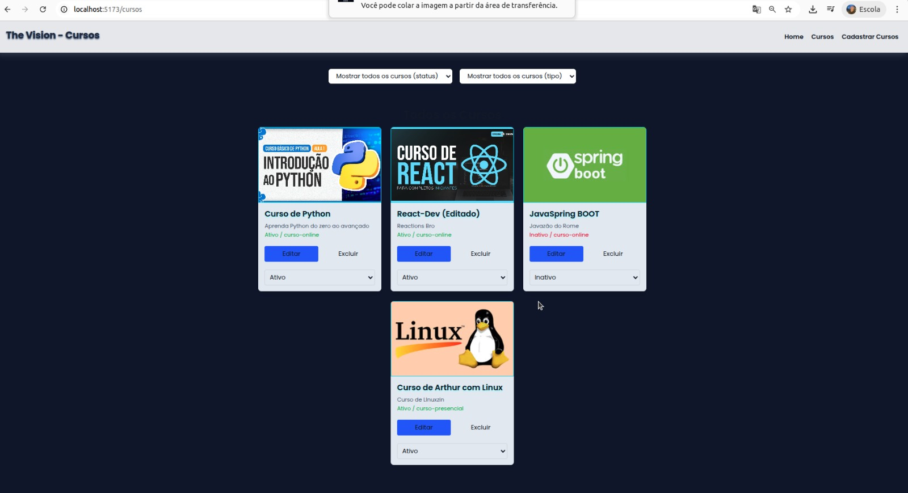
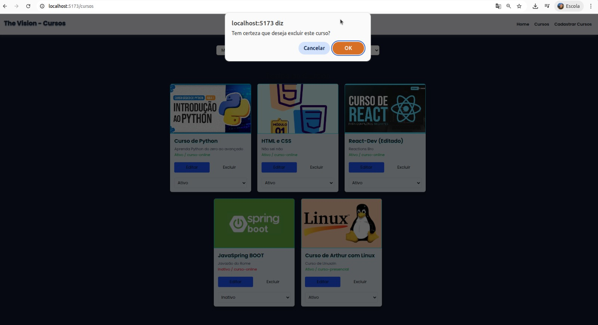
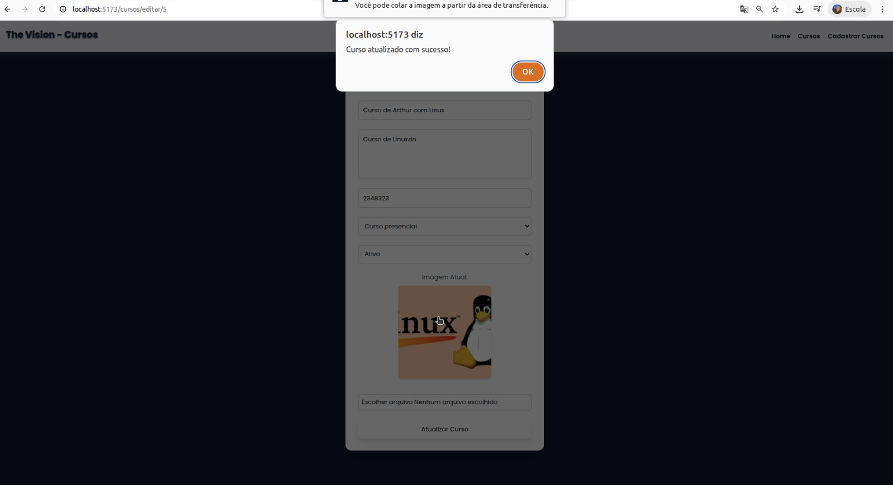
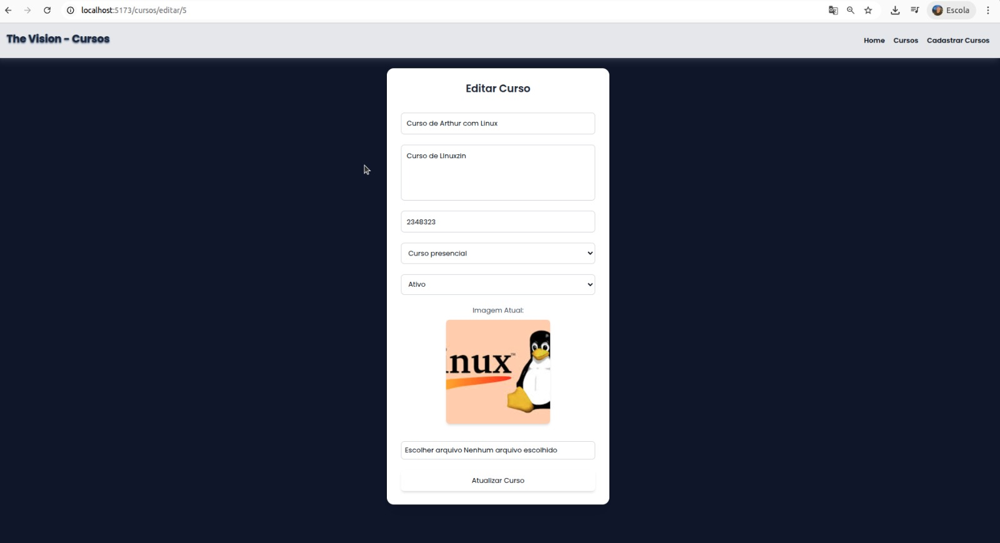
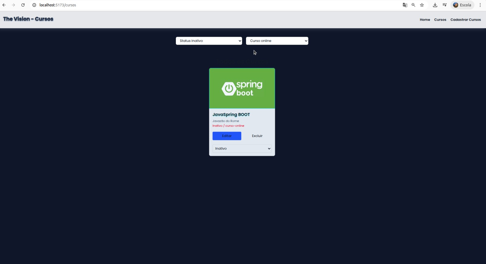
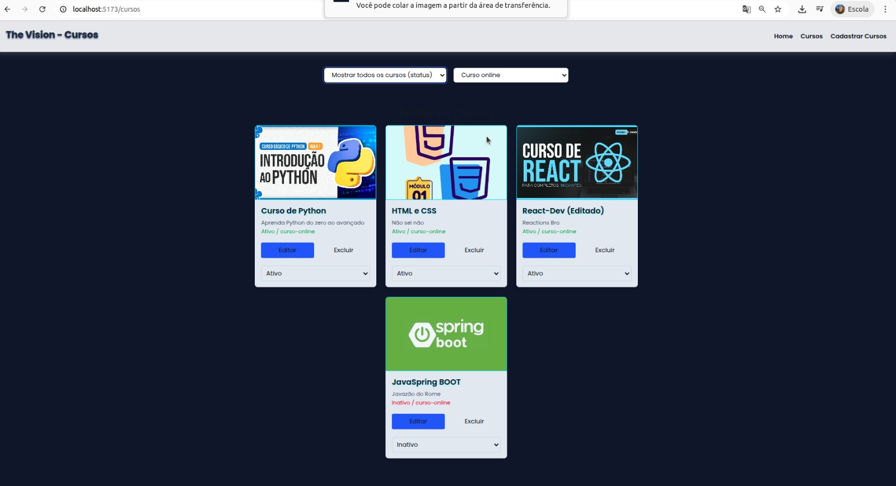
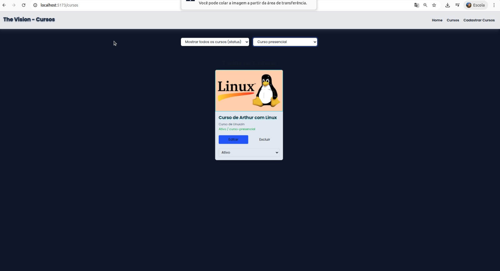
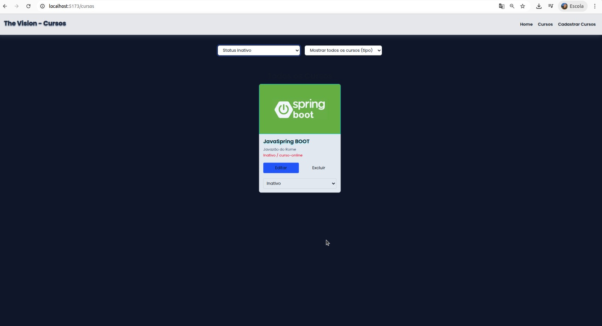
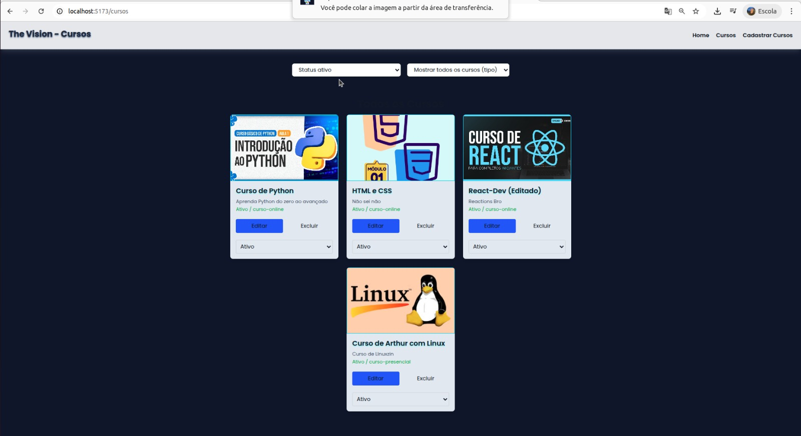
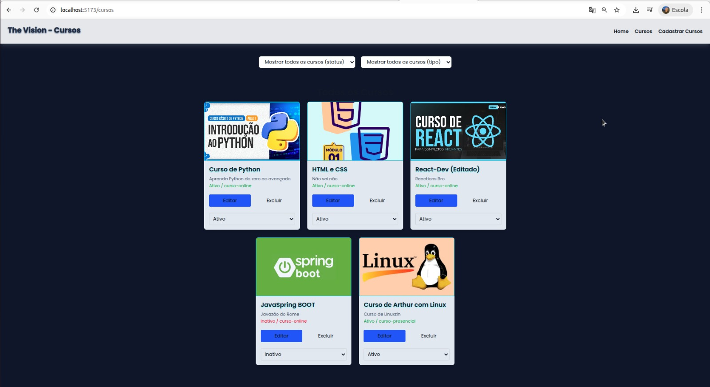
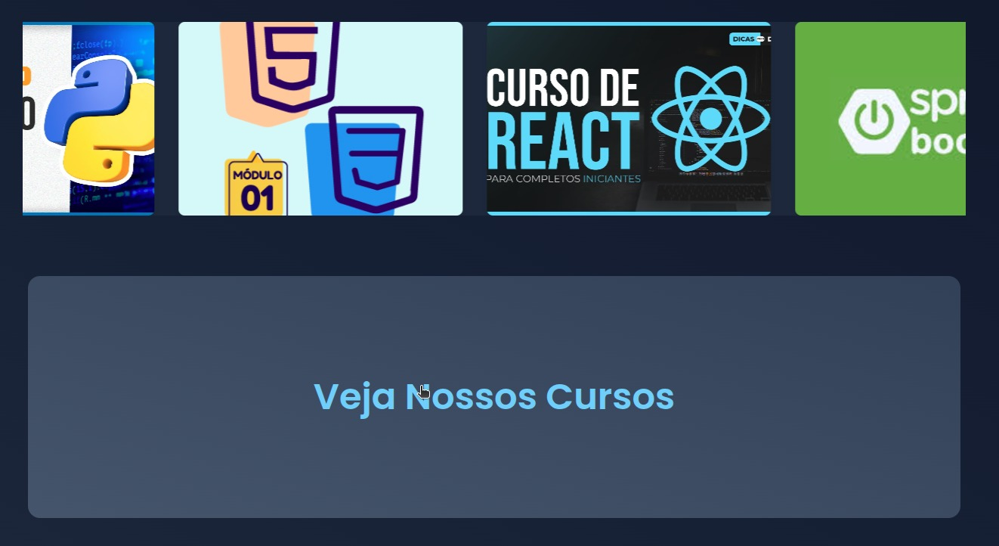
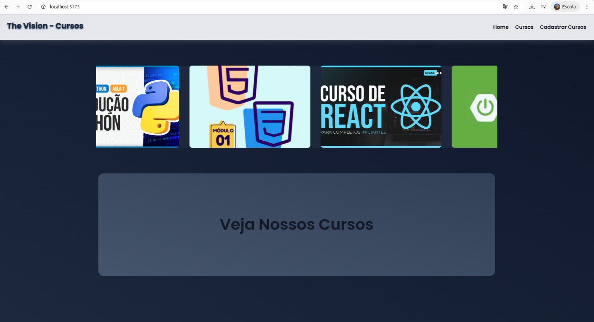